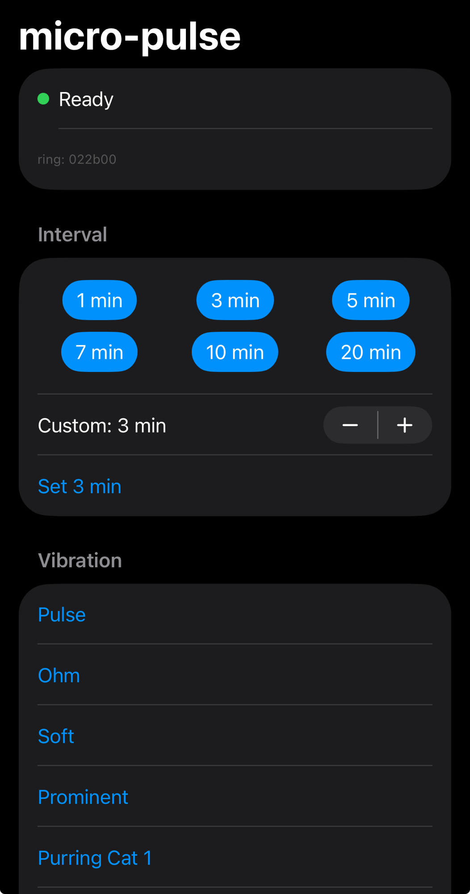

# micro-pulse

A tiny SwiftUI iPhone app to control a **Pulse mindfulness ring** over Bluetooth —
set an arbitrary **vibration interval** and pick a **vibration pattern** — bypassing
the official app's fixed presets. It talks to the ring using the phone's existing
bond, so no unpairing is needed. On the home screen it appears as **Micro Pulse**.

Built because the official Pulse app only offers four interval presets (20/30/60/120
min) and no way to choose intervals like 1, 3, or 7 minutes.

<p align="center">
  
</p>

## Build & run

Requires Xcode and a personal Apple ID (free) or paid developer account. From the
project directory:

```sh
xcodegen generate           # regenerates MicroPulse.xcodeproj from project.yml
open MicroPulse.xcodeproj
```

In Xcode:
1. `project.yml` pins `DEVELOPMENT_TEAM` to the author's team — put your own team id
   there and re-run `xcodegen`. (Setting **Team** under the **MicroPulse** target →
   **Signing & Capabilities** works too, but the next `xcodegen generate` drops it.)
2. Plug in your iPhone (or use a paired wireless device) and pick it as the run
   destination.
3. **Run** (⌘R). First launch: on the iPhone, trust the developer profile under
   *Settings → General → VPN & Device Management*.
4. Grant the Bluetooth permission prompt.

> Free Apple ID signing expires after 7 days — just re-run from Xcode to refresh.
> The `.xcodeproj` is generated (git-ignored); edit `project.yml` and re-run
> `xcodegen` to change build settings.

## Using it

Launch the app near the ring. It scans, connects, runs the unlock handshake, and
shows **Ready**. Then tap an interval preset (or set a custom value) or a vibration
pattern — each fires the full command sequence in a fraction of a second, and the
ring reacts immediately.

1 minute works; 10 seconds is rejected.

**Keep the official Pulse app force-quit** while using this — otherwise iOS may
reconnect the ring to it and steal the single BLE connection.

## Protocol

See [the protocol reference](docs/PROTOCOL.md) for the Bluetooth characteristics,
handshake, interval encoding, vibration patterns, capture findings, and known limits.

## Layout

```
project.yml               xcodegen spec (source of truth for the Xcode project)
Info.plist                written by xcodegen from project.yml — don't hand-edit
Sources/
  MicroPulseApp.swift      @main entry
  ContentView.swift        UI: status + interval/vibration buttons
  RingController.swift     CoreBluetooth: connect, handshake, sequential write queue
  Commands.swift           the byte-level protocol
Resources/
  Assets.xcassets/         app icon
```
